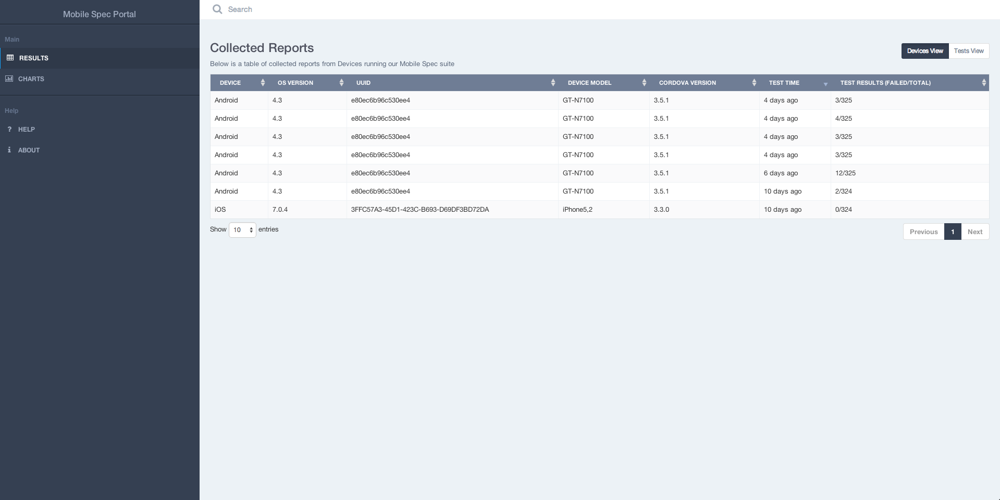

Mobile Spec Web Portal
=========================

The web portal allows you to view the automatic tests results of the [Mobile Spec App](https://github.com/feedhenry-templates/fh-mobile-spec-app). 

## Screenshots




## Usage

Just build the [Mobile Spec App](https://github.com/feedhenry-templates/fh-mobile-spec-app) within the same FeedHenry project, make sure the cloud app is running and then run the automatic tests. You can the view the test result details in this web portal.

## Dev Setup & Build

### Requirements

* [Nodejs](http://nodejs.org/)
* [Grunt](http://gruntjs.com/)
* [Bower](http://bower.io/)

### Development

All the development work should be done in the [app directory](./app).

For development, install all the dependecies using 

```javascript
npm install .
bower install .
```

Then run

```javascript
grunt serve
```

This will open the [dev index](app/index.html) page in the browser. Everytime a file is changed in the 'app' directory, the page will be reloaded automatically.

### Build

Then the development work is finished, run 

```
grunt build
```

This will generate distribute version to the [www](./www) directory.


